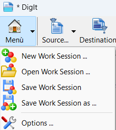

DigIt is an application to automatically scan and cut images with a single click. 
The cutting areas can be multiple and are saved in files with sequential numbering.

# Screen Shots
The Main Window has foldable panels with the list of captured images (which can be rotated, deleted, etc.).

You can select a source from which to acquire images, including Twain, WIA devices or a Folder Pictures,
(in next versions the acquisition from cameras will be supported).

For each device you can select settings such as image quality, size, etc.

When you acquire from a Feeder all pages are added in sequence.

It is possible to save the work session in order to continue later.

You can export images as PDF, optionally choosing the quality.

In case of scanners that do not support automatic front/back acquisition, it is possible to compose it with a specific Wizard.

# Prerequisites to Compile

DigIt use the following packages, you need to install them in Lazarus before you can compile it

- BGRABitmap (dev branch) at https://github.com/bgrabitmap/bgrabitmap/tree/dev-bgrabitmap
- BGRAControls (dev branch) at https://github.com/bgrabitmap/bgracontrols/tree/dev-bgracontrols
- MaxM Commons at https://github.com/maxm74/MaxM/tree/main/Commons

 for Windows Platforms:

 - DelphiTwain at https://github.com/maxm74/DelphiTwain
 - WIAPascal at https://github.com/maxm74/WIAPascal

you also need to use the latest version of Lazarus with fpc at least version 3.3.1

(c) 2024 Massimo Magnano.
